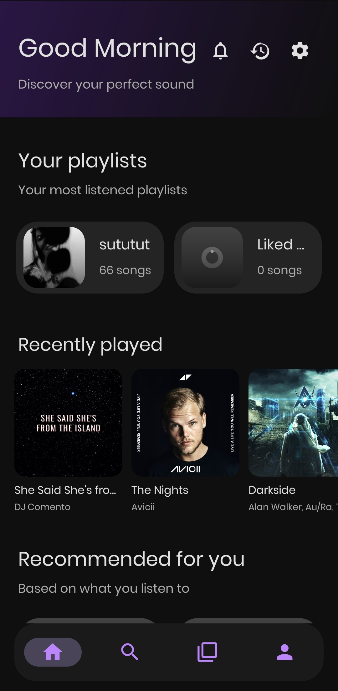
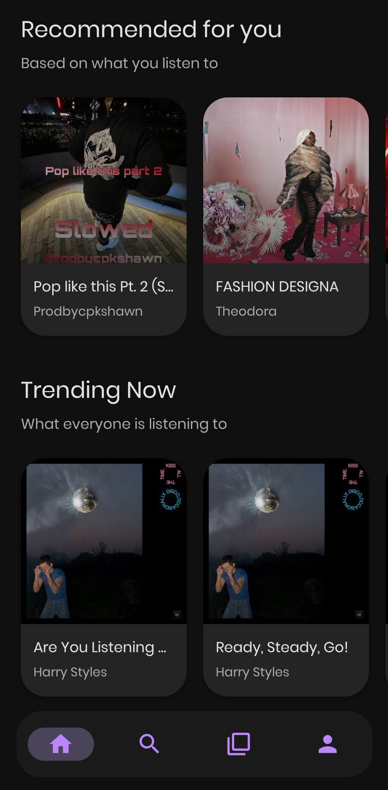
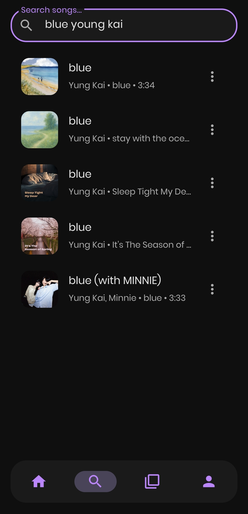
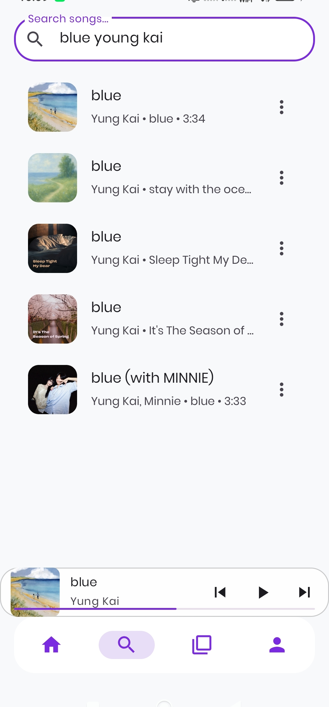

<div align="center">

# DAYNIGHT MUSIC
### A Premium Android Music Experience

[](https://github.com/DeadZone-0/DayNight-Music/releases)
[](https://daynightmusic.vercel.app/)
[](https://github.com/DeadZone-0/DayNight-Music/stargazers)
[](https://github.com/DeadZone-0/DayNight-Music/network/members)
[](LICENSE)

<p align="center">
  <b>Modern. Elegant. Open Source.</b><br>
  Daynight Music is a high-performance Android music streaming application built for speed and aesthetics. Inspired by modern minimalist design, it provides a seamless interface for discovering and enjoying your favorite tracks.
</p>

---

[Features](#features) • [Screenshots](#screenshots) • [Tech Stack](#tech-stack) • [Installation](#installation) • [Contributing](#contributing)

</div>

---

## Technical Overview

```diff
+ Synchronized Lyrics (LRCLib Integration)
+ Low-Latency Streaming via unofficial JioSaavn API
+ Intelligent Recommendations via Last.fm
+ Advanced Offline Caching System
+ Dynamic User Authentication & Cloud Sync
- Redundant Debug Logs
- Unoptimized Media Sessions
```

## Features

- **Elegant UI Ecosystem**: A dark bluish-purple theme optimized for OLED displays and late-night listening.
- **Smart Queue Management**: Manage your playback with shuffle, repeat.
- **Offline Mode**: Native support for downloading and managing high-quality audio files for data-free listening.
- **Social Integration**: Like tracks and sync your personal library across devices.
- **Sleep Timer**: Built-in utility to preserve battery while you sleep.

## Screenshots

<div align="center">
  <table style="border: none;">
    <tr>
      <td align="center"></td>
      <td align="center"></td>
      <td align="center"></td>
    </tr>
    <tr>
      <td align="center"></td>
      <td align="center"></td>
      <td align="center"></td>
    </tr>
  </table>
</div>

## Tech Stack

<div align="center">

[](https://developer.android.com/)
[](https://www.java.com/)
[](https://square.github.io/retrofit/)
[](https://github.com/bumptech/glide)
[](https://www.last.fm/api)

</div>

## Activity & Metrics

**Development Velocity**
<br>


</div>

## Project Roadmap

- [x] caching system
- [x] Offline download management
- [x] user authentication
- [x] "Recently Played" and Library sync
- [x] Fluid UI animations and transitions
- [x] Core music playback engine
- [x] homepage
- [x] song recommendations
- [x] Cross-platform playlist import
- [x] Sleep timer implementation
- [ ] am still thinking what to do next 

## Installation

1. Navigate to the [Releases](https://github.com/DeadZone-0/DayNight-Music/releases) page.
2. Download the latest `app-release.apk`.
3. Enable "Install from Unknown Sources" in your Android settings.
4. Install and start listening.

## Contributing

We welcome contributions from the community. Please review our [Contributing Guidelines](CONTRIBUTING.md) for details on our code of conduct and the process for submitting pull requests.

---


