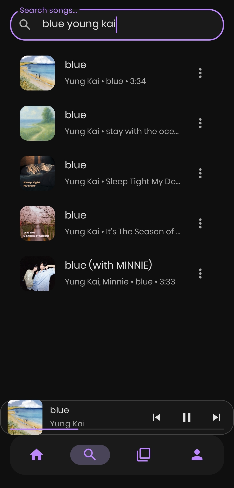
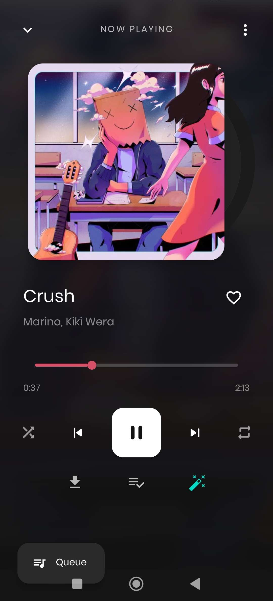
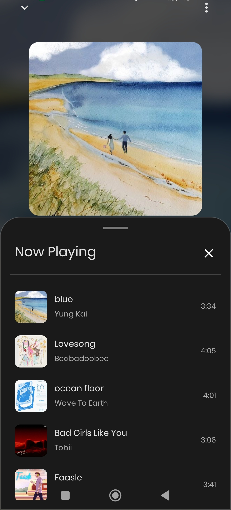

# Daynight Music

Daynight Music is a beautiful dark-themed Android music streaming app with a modern UI inspired by **Spotify**, developed during a vacation project. It uses an **unofficial JioSaavn API** to stream and display music content.

> **Note**: This project is for educational purposes only.

---
## Website - [Daynight Music](https://daynightmusic.vercel.app/)
---

## Features

- Elegant UI with a dark bluish-purple theme
- Browse popular songs on the home screen
- Search functionality for songs, albums, and artists
- Music playback with controls
- Song details and streaming support
- Create and manage playlists
- Liked songs and recent playback
- Download music for offline playback
- Bottom navigation for seamless navigation
- Optimized for Android (built using Java + Retrofit)

---

## Screenshots

  <table style="border: none;">
    <tr>
      <td align="center"></td>
      <td align="center"></td>
      <td align="center"></td>
    </tr>
    <tr>
      <td align="center"></td>
      <td align="center"></td>
      <td align="center"></td>
    </tr>
    <tr>
      <td align="center"></td>
      <td align="center"></td>
      <td align="center"></td>
    </tr>
    <tr>
      <td align="center"></td>
      <td align="center"></td>
      <td align="center"></td>
    </tr>
  </table>

---

## Tech Stack

- **Language**: Java
- **API**: [Unofficial JioSaavn API](https://github.com/cyberboysumanjay/JioSaavnAPI)
- **Recommendation API**: [LAST FM API](https://www.last.fm/api)

---

## To-Do

- [x] Implement caching for faster loading
- [x] add offline download handling
- [x] Add user authentication
- [x] Add recently played section
- [x] UI animation improvements
- [x] Actually playing music
- [x] Working homepage with trending
- [x]  song recommendation and recommended queue
- [x]  playlist import from other sources
- [x]  sleep timer

---

